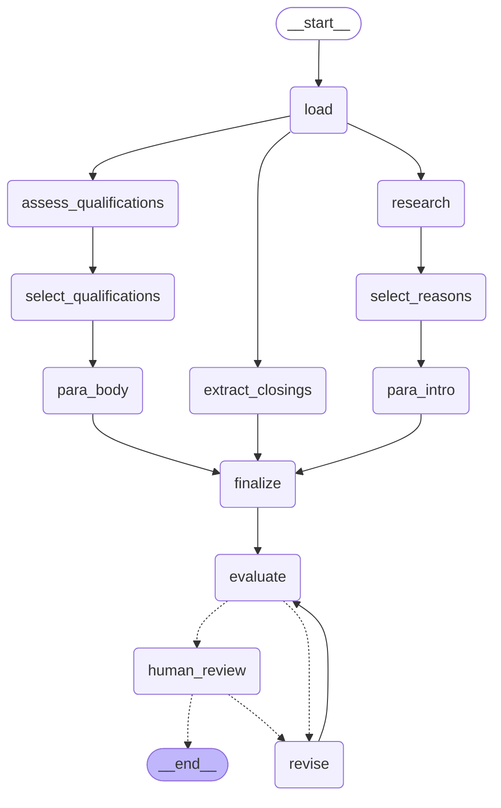

# Agentic Cover Letter Generator

A LangGraph agent that turns **a job posting + a CV + past cover letters** into a tailored cover
letter — with live company research, human-in-the-loop control over what the letter builds on, a
bounded self-correction loop, and a final human approval gate. Deployed as a FastAPI backend
(Render) with a Streamlit frontend.

## Architecture



Generated straight from the compiled graph (`agent.graph.get_graph().draw_mermaid()`), so it can't
drift out of sync with the actual node/edge wiring. Dashed arrows are the conditional edges -
`evaluate`'s pass/revise branch and `human_review`'s approve/revise branch - both bounded (see
`max_auto_revisions` in [Configuration](#configuration)) rather than open-ended loops.

### Nodes

| Node | What it does |
|---|---|
| `load` | Reads the job ad / CV / past letters (from disk locally, or from the API request). |
| `extract_closings` | Pure Python — pulls the closing paragraph out of each past letter, for `finalize` to model the new one on. No model call. |
| `research` | One call, bound to a web-search tool: identifies the company/team, gathers checkable facts (each tied to a source URL it actually retrieved), and ranks candidate motivations for wanting the role. |
| `assess_qualifications` | Ranks the candidate's qualifications against the job ad, with evidence from the CV and the specific value each would bring to *this* team — not just "I have X", but "X solves Y for you". |
| `select_reasons` / `select_qualifications` | Two **independent** human-in-the-loop gates (each individually toggleable): a person picks which researched reasons / qualifications the letter should actually build on, or adds their own. Off, each falls back to an automatic top-N pick. |
| `para_intro` / `para_body` | Write the opening and body paragraphs, grounded in whatever was selected — written independently and concurrently, since neither depends on the other. |
| `finalize` | Stitches the two paragraphs, runs deterministic checks (placeholders, salutation), and in one LLM call both writes the closing paragraph (modelled on the candidate's own past closings) and resolves any repetition/incoherence left over from writing the paragraphs blind to each other. |
| `evaluate` / `revise` | An LLM judge scores the letter (grounded / specific / coherent / flows well / overall score) and lists unsupported claims; `revise` fixes exactly what was flagged. Loops automatically, capped at `max_auto_revisions` passes, until every check passes or the cap is hit. |
| `human_review` | Final human gate (independently toggleable): approve, edit directly, or request another revision with notes. |

### Key engineering decisions

- **Reliability over convenience in extraction.** `research()` originally parsed the model's free
  text for `COMPANY:`/`ROLE:`/`REASONS:` headings with regex — which silently returned nothing
  whenever the model formatted a heading slightly differently. Replaced with a small
  structured-output call (Pydantic schema) for the field that actually feeds a human-facing picker,
  since "usually works" isn't good enough when a parsing failure means an empty selection screen.
- **Grounding, not just prompting for accuracy.** Every fact `research()` writes down is checked
  against the URLs actually retrieved by the search tool; lines citing a URL that was never
  returned are dropped before the fact ever reaches later nodes.
- **Two human-in-the-loop gates, each independently optional.** Choosing which reasons/qualifications
  a letter is built on is treated as a decision worth putting in a human's hands — but each gate is
  its own flag, so any combination can run fully automatically or fully interactively.
- **Bounded self-correction, not an open-ended loop.** `evaluate`/`revise` will keep fixing flagged
  issues, but only up to a fixed cap — an earlier design let two LLM roles (a quality reviewer and
  a fact-checker) argue with each other indefinitely; this stays a converging, bounded process.
- **Multi-interrupt handling.** Because `research` and `assess_qualifications` run concurrently,
  their two downstream human gates can become due in the same LangGraph step. Both the API and the
  Streamlit frontend handle resuming *either or both* of two simultaneously-pending interrupts
  correctly, keyed by interrupt id — not just the single-interrupt case most examples cover.
- **Concurrency for latency, not just parallelism for its own sake.** `research`'s web search is the
  slow step; `assess_qualifications` and `extract_closings` are wired directly off `load` (not
  chained behind each other) specifically so their work overlaps with the search instead of adding
  to the critical path.

## Repo layout

- **`agent.py`** — the whole pipeline: state, prompts, nodes, the compiled graph. The single
  source of truth - nothing else defines any of this independently.
- **`api.py`** — FastAPI backend: `/generate`, `/generate/upload`, `/generate/resume`, API-key
  gated. Deployed on Render via the included `Dockerfile`.
- **`streamlit_app.py`** — password-gated frontend that talks to the API, rendering each
  human-in-the-loop gate as its own form and supporting multiple simultaneously-pending gates.
- **`graph.py`** — a one-line re-export of `agent.py`'s graph, so `langgraph dev`/LangGraph
  Studio (pointed here via `langgraph.json`) and the Dockerfile's build step have a plain module
  to import.
- **`tests/`** — pytest suite for the API, run in CI on every push/PR (`.github/workflows/ci.yml`).

## Quick start

```bash
uv venv --python 3.13
uv sync
```

Put your key in `.env`:

```
ANTHROPIC_API_KEY=sk-ant-...
```

Drop `job_posting.(txt|pdf|docx|md)`, `cv.(txt|pdf|docx)`, and any past letters into `inputs/`
(or copy `inputs/example/` there for a synthetic sample that runs out of the box).

**As a local API + frontend:**

```bash
.venv/bin/fastapi dev api.py            # backend on :8000
.venv/bin/streamlit run streamlit_app.py  # frontend, needs APP_API_KEY/API_BASE_URL in .streamlit/secrets.toml
```

**Via LangGraph Studio:**

```bash
uv run langgraph dev
```

## Configuration

All in `agent.py`'s `Config` dataclass:

| Setting | Default | Notes |
|---|---|---|
| `model` | `claude-opus-5` | Used by every node. |
| `output_language` | `English` | Independent of the posting's language. |
| `intro_words` / `body_words` / `close_words` | 95 / 235 / 45 | Per-paragraph word budgets. |
| `max_words` | 390 | Hard ceiling on the finished letter, checked post-generation. |
| `web_search_max_uses` | 6 | Shared budget across direct `web_search` calls *and* any the model makes from code execution. |
| `eval_score_threshold` | 4 | `evaluate`'s overall_score bar (out of 5) to stop auto-revising. |
| `max_auto_revisions` | 3 | Cap on automatic evaluate→revise passes before falling through to human review regardless. |
| `dump_prompts` | `True` | Writes every rendered prompt to `outputs/.prompts/<node>.md`. |

## API

- `GET /` — health check.
- `POST /generate` — pasted job ad text/URL + CV/letters as text, plus three independent booleans:
  `select_reasons_in_the_loop`, `select_qualifications_in_the_loop`, `human_in_the_loop`.
- `POST /generate/upload` — same, but CV/letters as uploaded files (`.txt`/`.md`/`.pdf`/`.docx`).
- `POST /generate/resume` — continues a thread paused at one (or more) pending gates, keyed by
  `thread_id` and (when more than one gate is pending at once) `interrupt_id`.

All endpoints require an `X-API-Key` header.

## Testing

```bash
APP_API_KEY=testkey PYTHONPATH=. uv run pytest tests/test_api.py
```

Runs automatically in CI on every push/PR to `main`.

## Known limitations / roadmap

Being upfront about what this doesn't handle yet:

- **Checkpointing is in-memory (`InMemorySaver`).** Thread state doesn't survive a process
  restart — on Render's free tier, an idle-timeout spin-down or redeploy mid-flow loses any
  paused thread. Fine for a single local/CLI run; not yet suitable as a durable multi-step web
  flow. Next step: a persistent checkpointer (Postgres/SQLite-backed).
- **`/generate` blocks synchronously for the whole pipeline** (~3 minutes, several LLM calls)
  inside one HTTP request, which can exceed a platform gateway's own timeout independent of the
  client's. Next step: kick off the run and return a thread id immediately, with the frontend
  polling for status instead of holding one long-lived request open.
- **No offline eval set.** Quality is currently judged only by the LLM-judge *inside* the pipeline
  (`evaluate`); there's no held-out set of (job ad, CV) pairs with a rubric to measure quality
  changes across prompt iterations objectively.
- **No rate limiting / CORS policy** on the API beyond the shared API key.
